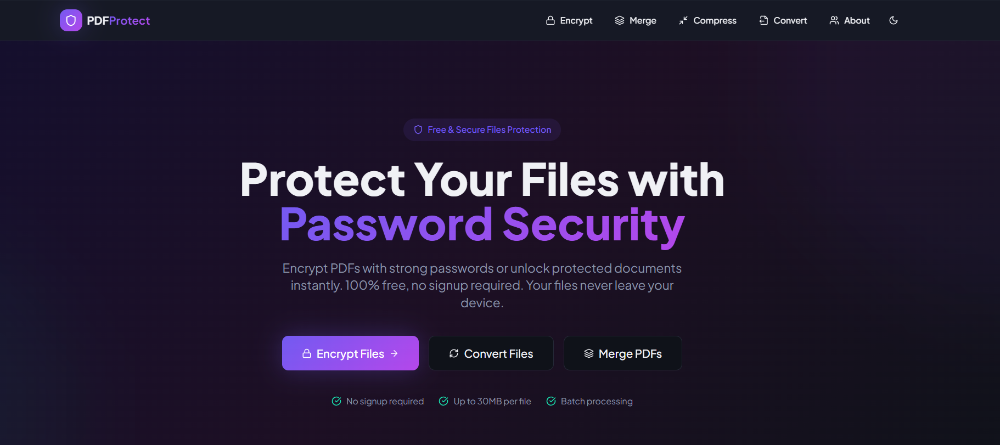
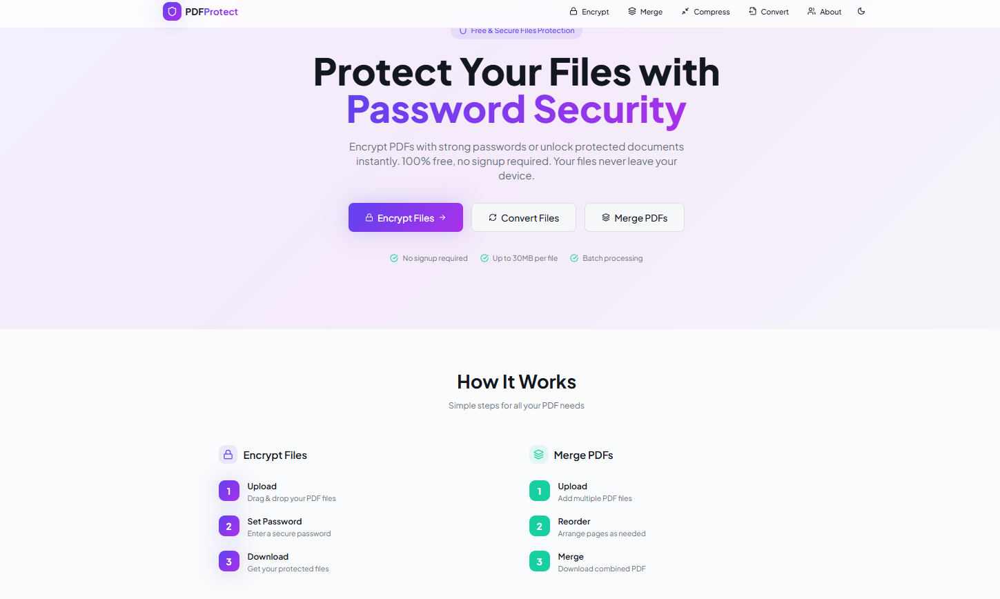

# Welcome to FileForge project

## Project info

**App view** 

**App view** 

**URL**: https://github.com/MarckoAbhi/pdf_merging11


**Live Preview**: https://marckoabhi.github.io/pdf_merging11/#/


## How can I edit this code?

There are several ways of editing your application.

**Use Lovable**

Simply visit the [[PDF Project](https://github.com/MarckoAbhi/pdf_merging11)]and start prompting.

Changes made via Lovable will be committed automatically to this repo.

**Use your preferred IDE**

If you want to work locally using your own IDE, you can clone this repo and push changes. Pushed changes will also be reflected in Lovable.

The only requirement is having Node.js & npm installed - [install with nvm](https://github.com/MarckoAbhi/pdf_merging11)

Follow these steps:

```sh
# Step 1: Clone the repository using the project's Git URL.
git clone https://github.com/MarckoAbhi/pdf_merging11

# Step 2: Navigate to the project directory.
cd <YOUR_PROJECT_NAME>

# Step 3: Install the necessary dependencies.
npm i

# Step 4: Start the development server with auto-reloading and an instant preview.
npm run dev
```

**Edit a file directly in GitHub**

- Navigate to the desired file(s).
- Click the "Edit" button (pencil icon) at the top right of the file view.
- Make your changes and commit the changes.

**Use GitHub Codespaces**

- Navigate to the main page of your repository.
- Click on the "Code" button (green button) near the top right.
- Select the "Codespaces" tab.
- Click on "New codespace" to launch a new Codespace environment.
- Edit files directly within the Codespace and commit and push your changes once you're done.

## What technologies are used for this project?

This project is built with:

- Vite
- TypeScript
- React
- shadcn-ui
- Tailwind CSS

## How can I deploy this project?

Simply open [PDF Merging](https://github.com/MarckoAbhi/pdf_merging11) and click on Share -> Publish.

## Can I connect a custom domain to my project?

Yes, you can!

To connect a domain, navigate to Project > Settings > Domains and click Connect Domain.

Read more here: [Setting up a custom domain](https://docs.lovable.dev/features/custom-domain#custom-domain)

---

## 🐳 Docker Deployment

This project includes Docker support for both development and production environments.

### Prerequisites

- [Docker](https://docs.docker.com/get-docker/) installed on your machine
- [Docker Compose](https://docs.docker.com/compose/install/) installed
- [Docker Hub](https://hub.docker.com/) account (for pushing images)

### Option 1: Using Docker Compose (Recommended)

#### Development Mode (with hot reload)

```bash
# Step 1: Start the development container
docker-compose up dev

# Step 2: Access the app
# Open http://localhost:3000 in your browser

# Step 3: Stop the container
docker-compose down
```

#### Production Mode (optimized with nginx)

```bash
# Step 1: Start the production container
docker-compose up prod

# Step 2: Access the app
# Open http://localhost:80 in your browser

# Step 3: Run in background (detached mode)
docker-compose up -d prod

# Step 4: Stop the container
docker-compose down
```

### Option 2: Using Docker Commands Directly

#### Build the Production Image

```bash
# Step 1: Build the Docker image
docker build -t fileforge:latest .

# Step 2: Run the container
docker run -d -p 80:80 --name fileforge fileforge:latest

# Step 3: Access the app
# Open http://localhost:80 in your browser

# Step 4: Stop and remove the container
docker stop fileforge
docker rm fileforge
```

#### Build the Development Image

```bash
# Step 1: Build the development Docker image
docker build -f Dockerfile.dev -t fileforge:dev .

# Step 2: Run the development container with volume mounting
docker run -d -p 3000:5173 -v $(pwd):/app -v /app/node_modules --name fileforge-dev fileforge:dev

# Step 3: Access the app
# Open http://localhost:3000 in your browser

# Step 4: Stop and remove the container
docker stop fileforge-dev
docker rm fileforge-dev
```

### Push to Docker Hub

```bash
# Step 1: Login to Docker Hub
docker login

# Step 2: Build the image with your Docker Hub username
docker build -t YOUR_DOCKERHUB_USERNAME/fileforge:latest .

# Step 3: Push the image to Docker Hub
docker push YOUR_DOCKERHUB_USERNAME/fileforge:latest

# Step 4: (Optional) Tag with version number
docker tag YOUR_DOCKERHUB_USERNAME/fileforge:latest YOUR_DOCKERHUB_USERNAME/fileforge:v1.0.0
docker push YOUR_DOCKERHUB_USERNAME/fileforge:v1.0.0
```

### Pull and Run from Docker Hub

```bash
# Step 1: Pull the image from Docker Hub
docker pull YOUR_DOCKERHUB_USERNAME/fileforge:latest

# Step 2: Run the container
docker run -d -p 80:80 --name fileforge YOUR_DOCKERHUB_USERNAME/fileforge:latest
```

### Useful Docker Commands

```bash
# View running containers
docker ps

# View all containers (including stopped)
docker ps -a

# View container logs
docker logs fileforge

# Enter container shell
docker exec -it fileforge sh

# Remove all stopped containers
docker container prune

# Remove unused images
docker image prune

# View Docker disk usage
docker system df
```

### Docker Files Overview

| File | Description |
|------|-------------|
| `Dockerfile` | Production build with multi-stage build and nginx |
| `Dockerfile.dev` | Development build with hot reload support |
| `docker-compose.yml` | Orchestrates both dev and prod services |
| `nginx.conf` | Nginx configuration for production serving |
| `.dockerignore` | Files to exclude from Docker build context |
